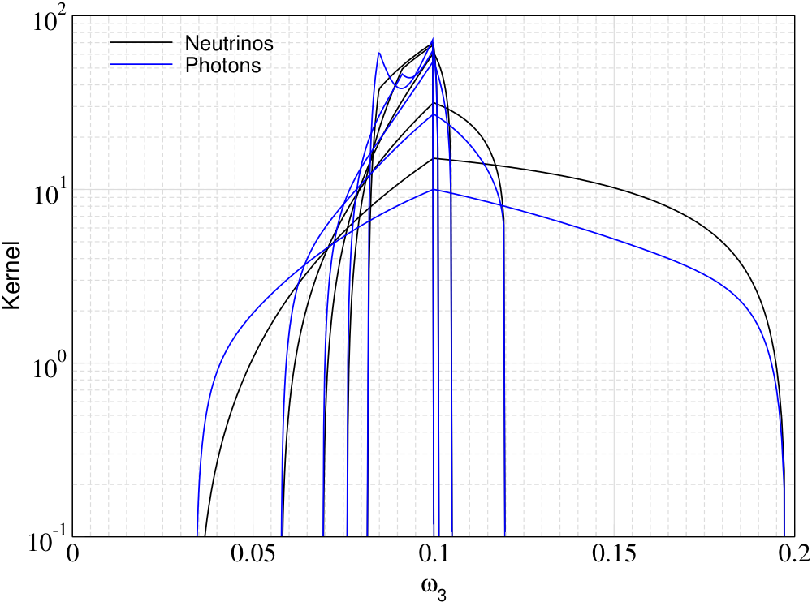
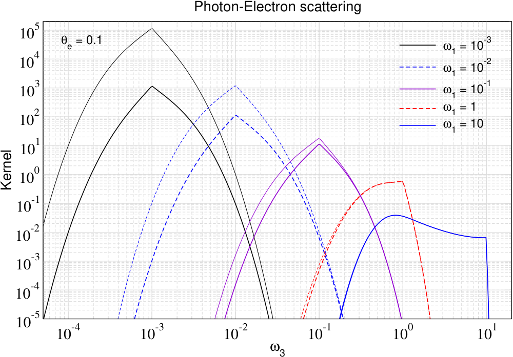
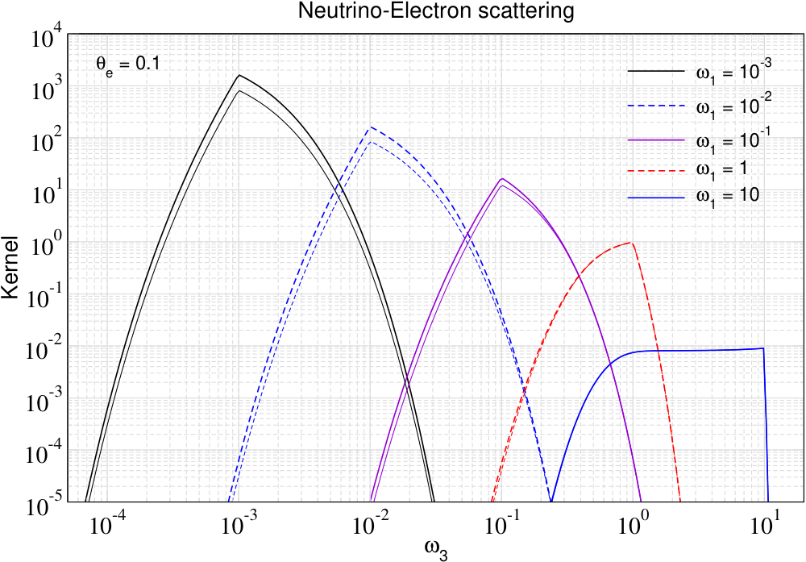

# Purpose

CSpack evaluates energy redistribution kernels for photon-electron Compton
scattering and neutrino scattering on electrons and positrons in isotropic
media. The library provides fixed-scatterer kernels, thermal averages over
electron or positron distributions, kernel moments, compressed spline
representations, and scattering matrices for repeated-scattering solvers.

The photon part follows Sarkar, Chluba and Lee (2019), the CSpack Compton
kernel paper. The neutrino extension follows Chluba, Cyr, Uwabo-Niibo and
Yamaguchi (2026), where the isotropic neutrino-electron kernel is reduced from
the full collision integral to a compact kernel form and added to CSpack.

CSpack is a library rather than a standalone evolution solver. The example
program [CSpack_main.cpp](../CSpack_main.cpp) illustrates common calls, while
`CSpack/CSpack.h` collects the public C++ headers. A small C interface is
declared in `CSpack/CSpack_c.h` for integration weights and photon scattering
matrix setup.

# Variables and Normalization

The main routines use dimensionless variables:

| Symbol | Code name | Meaning |
|---|---|---|
| $\omega_0$, $\omega_1$ | `omega0`, `omega1` | Incoming photon or neutrino energy in units of $m_ec^2$. |
| $\omega$, $\omega_3$ | `omega`, `omega3` | Outgoing photon or neutrino energy in units of $m_ec^2$. |
| $p_0$, $p_2$ | `p0`, `p2` | Scatterer momentum in units of $m_ec$. |
| $\gamma$ | `gamma_f(p)` | Electron or positron Lorentz factor $\sqrt{1+p^2}$. |
| $\Theta$ | `theta`, `The` | Scatterer temperature $kT_e/(m_ec^2)$. |
| $x$ | `xarr[i]` | Grid energy, usually $\omega/\Theta_g$. |
| $\mu_e$ | `mue` | Electron chemical potential parameter used by the FD routines. |

The low-level photon kernels return the redistribution shape with the Thomson
normalization factored out. The low-level neutrino kernels return the
redistribution shape after factoring out the reference weak-scattering
normalization used in the neutrino-kernel paper. The neutrino matrix wrapper
adds the low-energy $x_0^2$ scaling and the optional process normalization
through `sigma_norm`.

# Building

The repository builds through the top-level `Makefile`, which delegates to
`Makefile.in`.

```sh
make lib
make bin
```

`make lib` creates `libCSpack.a`. `make bin` also links the example program
`CSpack_main`. The default `Makefile.in` expects GSL and Boost headers/libraries
under the configured Homebrew paths and enables OpenMP through `g++`.

For external C++ code, include the umbrella header and link against the static
library plus the same numerical dependencies:

```cpp
#include "CSpack.h"
```

# Low-Level Kernel Routines

The fixed-scatterer kernels all use the function-pointer type

```cpp
typedef double (*kernel_ptr)(double, double, double);
```

The arguments are `(incoming_energy, scatterer_momentum, outgoing_energy)`.
This common signature lets photon and neutrino kernels be passed through the
same moment, FD-average, output, and representation machinery.

## Kinematic Helpers

`CSpack_functions` contains the shared kinematic layer used by both photon and
neutrino kernels:

| Function | Role |
|---|---|
| `gamma_f(p)`, `pfunc(gamma)` | Convert between momentum and Lorentz factor. |
| `gamma_sc(omega0, p0, omega)` | Final scatterer Lorentz factor after an energy transfer. |
| `pfunc_sc(omega0, p0, omega)` | Final scatterer momentum after an energy transfer. |
| `omegamin`, `omegacrit`, `omegamax` | Allowed outgoing-energy limits for fixed incoming energy and scatterer momentum. |
| `Get_zone(omega0, p0, omega)` | Branch selector for the analytic kernel expressions. |
| `lambda_p`, `lambda_m`, `kappa` | Invariants and auxiliary variables used inside the kernel expressions. |
| `mb_dist_func`, `mb_dist_norm`, `pbar` | Relativistic Maxwell-Boltzmann distribution helpers for thermal averaging. |

These are useful for diagnostics and for checking support limits before
evaluating a kernel. Most users call the higher-level kernel functions directly.

## Photon Kernels

`CSpack_kernels` implements photon-electron redistribution kernels:

| Function | Use |
|---|---|
| `kernel_exact(omega0, p0, omega)` | Exact isotropic Compton kernel for a fixed electron momentum. |
| `kernel_recoil` | Recoil-dominated limiting kernel. |
| `kernel_doppler` | Doppler-dominated limiting kernel. |
| `kernel_ur` | Ultra-relativistic limiting kernel. |
| `kernel_all(..., type)` | String-dispatched fixed-momentum photon kernel. |
| `Get_kernel_pointer(type, calling_func)` | Returns a `kernel_ptr` for `exact`, `recoil`, `doppler`, or `ur`. |

The exact kernel first checks the allowed outgoing-energy interval, chooses the
appropriate scattering zone, computes the branch variables, and evaluates the
analytic expression. Outside the allowed kinematic region it returns zero.

## Neutrino Kernels

`CSpack_kernels_nu` implements neutrino scattering kernels with the same
`kernel_ptr` signature:

| Function | Process |
|---|---|
| `kernel_exact_nue_e` | Electron-neutrino scattering on electrons. |
| `kernel_exact_nue_p` | Electron-neutrino scattering on positrons. |
| `kernel_exact_nue_ep` | Sum of electron and positron targets. |
| `kernel_exact_numu_e`, `kernel_exact_numu_p` | Muon-neutrino scattering on electrons or positrons. |
| `kernel_exact_nutau_e`, `kernel_exact_nutau_p` | Tau-neutrino scattering on electrons or positrons. |
| `Get_neutrino_kernel_pointer(type, calling_func)` | Returns the process-specific `kernel_ptr`. |
| `Get_neutrino_kernel_norm(type, calling_func)` | Coupling normalization relative to `nue_e`. |

Internally, the neutrino routines evaluate the zone-dependent analytic
integrals `I20`, `I_alpha`, and `I_beta` with chiral-coupling combinations
`alpha_LR` and `beta_LR`. The electron/positron and flavor variants are built
by changing the weak couplings rather than duplicating the kinematic machinery.

# Thermal Kernel Routines

There are two thermal-averaging layers.

The photon Maxwell-Boltzmann wrappers live in `CSpack_kernels`:

| Function | Use |
|---|---|
| `thermal_kernel_exact(omega0, omega, theta)` | Thermal average of the exact photon kernel. |
| `thermal_kernel_recoil`, `thermal_kernel_doppler`, `thermal_kernel_ur` | Thermal averages of the limiting photon kernels. |
| `thermal_kernel_SS_K`, `thermal_kernel_SS_C` | Sazonov-Sunyaev approximation kernels. |
| `thermal_kernel_exact_SS_C` | Exact kernel with the `SS_C` low-energy replacement. |
| `thermal_kernel_all(..., type)` | String-dispatched thermal photon kernel. |
| `Get_thermal_kernel_pointer(type, calling_func)` | Returns a photon thermal-kernel pointer. |

The generic Fermi-Dirac thermal average lives in `CSpack_kernels_FD`:

| Function | Use |
|---|---|
| `norm_FD(theta, mue)` | Normalization for the FD scatterer distribution. |
| `thermal_kernel_FD(omega0, omega, theta, mue, K, add_FB)` | Thermal average of any fixed-momentum kernel `K`. |
| `output_thermal_kernel(...)` | Writes simple thermal-kernel tables for plotting. |

`thermal_kernel_FD` is the bridge used for neutrino kernels, and it can also be
used with the photon `kernel_exact` when a FD scatterer distribution is desired.
The `add_FB` flag controls final-state factors:

| `add_FB` | Factors applied |
|---|---|
| `0` | No final-state factor. |
| `1` | Final-state electron blocking. |
| `2` | Final-state electron and neutrino blocking. |
| `3` | Final-state electron blocking and photon stimulation. |

# Link to Representation Routines

The representation layer avoids evaluating expensive thermal kernels at every
matrix entry. It samples a thermal kernel around each incoming energy and stores
the result as splines in the logarithmic energy-transfer variable.

The generic representation interface is

```cpp
typedef double (*thermal_kernel_ptr)(double omega0,
                                     double omega,
                                     double theta,
                                     void *p);
```

This is deliberately one level above `kernel_ptr`. A `kernel_ptr` describes a
fixed-scatterer kernel. A `thermal_kernel_ptr` describes a thermally averaged
kernel that can be sampled and interpolated by `Kernel_representation`.

Two adapters connect the low-level kernels to the representation machinery:

| Adapter | Input parameter block | What it calls |
|---|---|---|
| `thermal_kernel_photon_KR` | Optional `std::string *type` | `thermal_kernel_all(omega0, omega, theta, type)` |
| `thermal_kernel_neutrino_KR` | `Kernel_representation_nu_params *` | `thermal_kernel_FD(omega0, omega, theta, mue, K, add_FB)` |

For neutrinos, `Kernel_representation_nu_params` stores `mue`, `theta_g`,
`sigma_norm`, the selected fixed-momentum kernel `K`, and `add_FB`. The adapter
then multiplies the FD-averaged kernel by `sigma_norm*x0*x0`, where
`x0=omega0/theta_g`.

The practical flow is:

```text
fixed-scatterer kernel_ptr
    -> thermal averaging
    -> thermal_kernel_ptr adapter
    -> Kernel_representation splines
    -> bin-averaged scattering matrix
```

This is why the same matrix code can handle photons, neutrinos, or another
thermal kernel with the same adapter signature.

# Structograms

These Nassi-Shneiderman style diagrams summarize the main call paths.

| Fixed-Momentum Kernel Evaluation |
|---|
| Input `omega0`, `p0`, `omega`, selected `kernel_ptr K`. |
| Compute kinematic limits with `omegamin`, `omegacrit`, `omegamax`. |
| If `omega` is outside the allowed interval, return zero. |
| Determine the analytic branch with `Get_zone` or the photon branch tests. |
| Evaluate the exact or approximate kernel expression. |
| Return the dimensionless redistribution kernel. |

| Thermal Averaging |
|---|
| Input `omega0`, `omega`, `theta`, distribution parameters, fixed kernel `K`. |
| Determine the lower momentum limit from the scattering kinematics. |
| Choose the upper integration range from `pbar(theta)` and the distribution tail. |
| Integrate over `log(p)` with Patterson quadrature. |
| Apply Maxwell-Boltzmann or Fermi-Dirac normalization. |
| Optionally multiply by final-state blocking or stimulation factors. |
| Return the thermally averaged kernel. |

| Kernel Representation and Matrix Setup |
|---|
| Input grid `xarr`, temperatures `theta` and `theta_g`, matrix threshold `epsilon`. |
| Select photon type or neutrino process and construct the thermal-kernel adapter. |
| For each incoming grid point, initialize `Kernel_representation`. |
| Sample the thermal kernel on the up/down logarithmic wings. |
| Store positive kernel values in splines and compute requested moments. |
| Integrate each outgoing bin explicitly or through the representation. |
| Drop matrix entries below `epsilon` and assemble `Msc`. |

# Scattering Matrices

`CSpack_scattering_matrix` builds redistribution matrices on an energy grid.
The grid values are usually `x=omega/theta_g`; for the simplest photon calls
`theta_g=theta`.

| Function | Use |
|---|---|
| `Integral_weights` | Computes quadrature weights for a supplied grid. |
| `compute_scattering_matrix(..., Int_wi, Msc, type, epsilon)` | Explicit photon matrix using a thermal kernel. |
| `compute_scattering_matrix(..., nK, Msc, KR, ...)` | Photon or generic matrix using `Kernel_representation`. |
| `compute_scattering_matrix_bin_averaged` | Photon bin-averaged matrix with `theta_g=theta`. |
| `compute_scattering_matrix_bin_averaged_II` | Generic or photon bin-averaged matrix with separate `theta` and `theta_g`. |
| `compute_scattering_matrix_neutrino_bin_averaged_II` | Neutrino bin-averaged matrix using FD-averaged kernels. |
| `compute_sigma_tot` | Sums matrix rows into total scattering rates. |
| `Msc_representation` | Sparse matrix wrapper for one temperature. |
| `Msc_representation_Te` | Temperature-table wrapper for repeated use over a temperature range. |

The matrix entries are stored as bin-integrated redistribution probabilities
with the thermal-kernel normalization and grid weights already applied. The
`epsilon` threshold can be used to compress very small entries; values below
about `1.0e-4` are the usual practical regime when compression is desired.

# Kernel Moments and Fokker-Planck Coefficients

`CSpack_kernel_moments` exposes analytical and numerical moment routines:

| Function | Use |
|---|---|
| `compute_exact_moments_analytical` | Fixed-electron exact Compton moments. |
| `compute_nr_moments_analytical`, `compute_ur_moments_analytical` | Non-relativistic and ultra-relativistic limits. |
| `compute_recoil_moments_analytical`, `compute_doppler_moments_analytical` | Limiting recoil and Doppler moments. |
| `moment_Int_therm`, `moment_Int_app1`, `moment_Int_app2`, `moment_Int_app3` | Thermal moment approximations. |
| `moment_2D_Int_therm_all_II` | Thermally averaged moment from a two-dimensional integration. |
| `compute_all_FP_coefficients` | Coefficients for a Fokker-Planck approximation. |
| `G_moment_2D_Int_therm_all_II` | Combination `2 Sigma2 - Sigma1` used by the representation layer. |
| `CSpack_kernel_moments_numerical::Sigma_func` | Numerical fixed-scatterer moment for any `kernel_ptr`. |

These routines are the connection between the full kernel description and
diffusion-style approximations such as Kompaneets or related Fokker-Planck
limits.

# Other Public Helpers

| Module | Main role |
|---|---|
| `CSpack_weights` | Builds trapezoidal, higher-order, log-grid, and weighted Lagrange integration weights. |
| `CSpack_Collision_Terms` | Evaluates collision terms and thermal moments for equilibrium input distributions. |
| `CSpack_opacity` | Computes generalized neutrino scattering optical depths and unity-crossing scales. |
| `CSpack_energy_losses` | Computes photon and electron energy exchange, removal, and double-Compton related helper terms. |
| `CSpack_equilibrium_solutions` | Converts between small temperature, number, energy, and chemical-potential perturbations. |
| `CSpack_c.h` | Provides C-callable Planck, integration-weight, and photon matrix setup wrappers. |

# Minimal Examples

Fixed-momentum photon and neutrino kernels:

```cpp
#include "CSpack.h"

using namespace CSpack_kernels;
using namespace CSpack_kernels_nu;

double omega0 = 0.1;
double p0 = 0.2;
double omega = 0.12;

double Pph = kernel_exact(omega0, p0, omega);
double Pnu = kernel_exact_nue_e(omega0, p0, omega);
```

Simple output tables for plotting:

```cpp
vector<double> p0a = {omega0/10.0, omega0/2.0, omega0, 2.0*omega0, 5.0*omega0};

output_kernel("./outputs/kernel_ph.dat", 2000, omega0, p0a,
              CSpack_kernels::kernel_exact);
output_kernel("./outputs/kernel_nu.dat", 2000, omega0, p0a,
              CSpack_kernels_nu::kernel_exact_nue_e);
```

Thermally averaged FD kernels:

```cpp
using namespace CSpack_kernels_FD;

vector<double> omega1 = {0.001, 0.01, 0.1, 1.0, 10.0};
double theta = 0.1;
double mue = -1.0e+2;

output_thermal_kernel("./outputs/kernel_nu_FD.dat", 500, omega1, theta, mue,
                      CSpack_kernels_nu::kernel_exact_nue_e, 0);
output_thermal_kernel("./outputs/kernel_nu_FD_block.dat", 500, omega1, theta, mue,
                      CSpack_kernels_nu::kernel_exact_nue_e, 2);
```

Photon scattering matrix:

```cpp
using namespace CSpack_scattering_matrix;
using namespace CSpack_weights;

vector<double> xarr;
init_xarr(1.0e-4, 1.0e+4, xarr, 300, 1, 0);

vector<double> Int_wi;
Integral_weights(xarr, Int_wi);

vector<vector<double>> Msc;
compute_scattering_matrix(xarr, theta, Int_wi, Msc, "exact+SS_C", 1.0e-8);
```

Neutrino bin-averaged matrix through the representation layer:

```cpp
vector<vector<double>> Mnu;
vector<Kernel_representation> KR;

double theta_g = theta;
double sigma_norm = 1.0;

compute_scattering_matrix_neutrino_bin_averaged_II(
    xarr, theta, theta_g, Mnu, KR,
    "nue_ep", 0.0, 2, 1.0e-8, sigma_norm
);
```

# Illustrative Kernel Plots

The repository already contains CSpack-generated figures under
`plots/nu-scattering`. The PNG images below are lightweight previews generated
from those PDFs.



Fixed-momentum photon and electron-neutrino kernels for the same incoming
energy and selected scatterer momenta. Full-resolution PDF:
[Kernel_nu_ph.pdf](../plots/nu-scattering/Kernel_nu_ph.pdf).



Thermally averaged photon-electron kernels at $\Theta_e=0.1$ for several
incoming energies. Full-resolution PDF:
[Kernel_ph_FD.pdf](../plots/nu-scattering/Kernel_ph_FD.pdf).



Thermally averaged electron-neutrino kernels at $\Theta_e=0.1$ for the same
incoming-energy sequence. Full-resolution PDF:
[Kernel_nu_FD.pdf](../plots/nu-scattering/Kernel_nu_FD.pdf).

# References

- Abir Sarkar, Jens Chluba, and Elizabeth Lee, "Dissecting the Compton
  scattering kernel I: Isotropic media," Monthly Notices of the Royal
  Astronomical Society **490**, 3705-3726 (2019), arXiv:1905.00868,
  DOI: 10.1093/mnras/stz2794, <https://arxiv.org/abs/1905.00868>.
- Jens Chluba, Bryce Cyr, Michiru Uwabo-Niibo, and Masahide Yamaguchi,
  "Neutrino-electron scattering kernels in isotropic media,"
  arXiv:2607.25436, <https://arxiv.org/abs/2607.25436>.
- S. Y. Sazonov and R. A. Sunyaev, "Cosmic microwave background radiation in
  the direction of a moving cluster of galaxies with hot gas: relativistic
  corrections," Astrophysical Journal **543**, 28-55 (2000).
